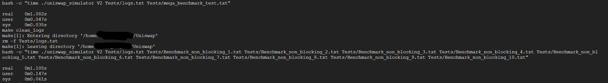

# Uniswap

## Overview
Uniswap is an automated liquidity protocol powered by a constant product formula. This project simulates simplified Uniswap V2 pools, allowing for adding/removing liquidity, swapping tokens, and performing arbitrage calculations between pools. Some concepts such as Flash Swap, Oracles, Pool Tokens are not implemented.

## Assumptions
- The input format for the simulation includes: `Action Pool_ID(not required for addPool) Amount_1 Amount_2 Timestamp`, `Sleep time`, `removePool Pool_ID`, `calculateArbitrage Pool_ID1 Pool_ID2`.
- Actions can be: `addPool`, `addLiquidity`, `removeLiquidity`, `swapDaiToEth`, `swapEthToDai`.
- Pool IDs are uint64_t type variables, which start from 0 and are managed by the `Pool_Manager`.
- This program can support V3 protocol in the future, but for now there is only V2 implemented.
- calculateArbitrage only supports two pools at each time.
- There could be more than one input file read by the program, files to read and log file to write in should be given at the start via argv. 

## Environment
- C++17 compiler (e.g., g++)
- Make (for building the project using the provided Makefile)
- Linux and Valgrind (if the user would like to run the Valgrind checking option)
- Python3 (If the user would like to run the benchmark test)

## Design Patterns and Structure
- **Singleton Pattern**: Ensures a single instance of the `Pool_Manager` throughout the application.
```plaintext
+----------------+       +----------------+
|                |       |                |
| Uniswap_V2     |------>|  LiquidityPool |
|                |       |                |
+----------------+       +----------------+
       ^
       |
       |     +----------------+
       |     |                |
       +---->|  Pool_Manager  |
             |                |
             +----------------+
                ^         ^
                |         |
                |         |
    +-------------+     +---------------+
    |             |     |               |
    |             |     |               |
    | Arbitrage_V2| <-- |Trade_Processor|
    |             |     |               |
    +-------------+     +---------------+
```

## Functions and Methods
- **LiquidityPool**: Base class representing a liquidity pool, with basic getter/setter methods implemented.
- **Uniswap_V2**: Derived class implementing Uniswap V2 specific operations. Previous virtual methods such as swap/addLiquidity are implemented. Trading actions related methods are guarded by a Mutex.
- **Pool_Manager**: Manages multiple pools, each pool can be accessed via Pool ID(uint64_t). Id starts from 0, and is recycled when a pool is removed.
  - `uint64_t addPool(std::shared_ptr<LiquidityPool> pool)`
  - `std::weak_ptr<LiquidityPool> getPool(uint64_t id)`
  - `std::shared_ptr<LiquidityPool> removePool(uint64_t id)`
- **Arbitrage_V2**: Calculates arbitrage opportunities between two pools, return <0.0, 0.0> if there is either no profit, or at least one pool does not exist any more.
  - `std::tuple<double, double> calculateArbitrage2Pools(uint64_t poolAId, uint64_t poolBId) const`

## Compiling and Running the Program
1. Navigate to the project directory.
2. Run `make` to compile the program.
3. Run `./uniswap_simulator V2 <log_file> <input_file1> <input_file2> ...` to run the simulation.
4. Run `make clean` to clean object files and the executable.
6. Run `make valgrind` to perform memory checks with Valgrind.
7. Run `make benchmark` to run benchmarking tests.(Make sure benchmark test files are generated in the Tests folder. If not, run `make generate_tests` first)
8. Run `make clean_benchmark_tests` and `make clean_logs` to clean generated benchmark test files and logs.

## Benchmark Results

The following benchmark compares the execution time of processing a single large file versus multiple smaller files concurrently. Both scenarios involve 10 pools and a total of 10000 actions.

```plaintext
time ./uniswap_simulator V2 Tests/logs.txt Tests/mega_benchmark_test.txt

real    0m1.089s
user    0m0.054s
sys     0m0.035s

time ./uniswap_simulator V2 Tests/logs.txt Tests/Benchmark_non_blocking_1.txt Tests/Benchmark_non_blocking_2.txt Tests/Benchmark_non_blocking_3.txt Tests/Benchmark_non_blocking_4.txt Tests/Benchmark_non_blocking_5.txt Tests/Benchmark_non_blocking_6.txt Tests/Benchmark_non_blocking_7.txt Tests/Benchmark_non_blocking_8.txt Tests/Benchmark_non_blocking_9.txt Tests/Benchmark_non_blocking_10.txt

real    0m1.107s
user    0m0.153s
sys     0m0.054s
```

These results indicate that the concurrency implementation is effective, with the concurrent processing time being comparable to the single file processing time.



## Miscellaneous
- Several test files are provided in the `Tests` folder, including arbitrage and multi-file scenarios. These are not randomly generated by the python script.

## Reference List
- [Uniswap V2 Explained (Beginner Friendly)](https://flow.com/engineering-blogs/uniswap-v2-explained-beginner-friendly)
- [Uniswap Whitepaper](https://uniswap.org/whitepaper.pdf)
- [Ethereum Stack Exchange - Uniswap V2 Optimal Arbitrage Amount](https://ethereum.stackexchange.com/questions/159056/uniswap-v2-optimal-arbitrage-amount)
- [YouTube Video on Uniswap](https://www.youtube.com/watch?v=9EKksG-fF1k)
